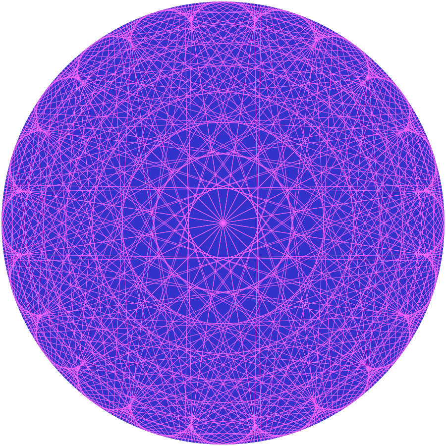

# MAOC
Modular Arithmatic on Circles

Inspired by the Mathlogger video [here](https://youtu.be/qhbuKbxJsk8?t=43). This video also explains how to draw it.

Demo here on [GitHub Pages](https://wolfmankurd.github.io/MAOC/).

Makes great avatars :)

### Examples

GPLv3
